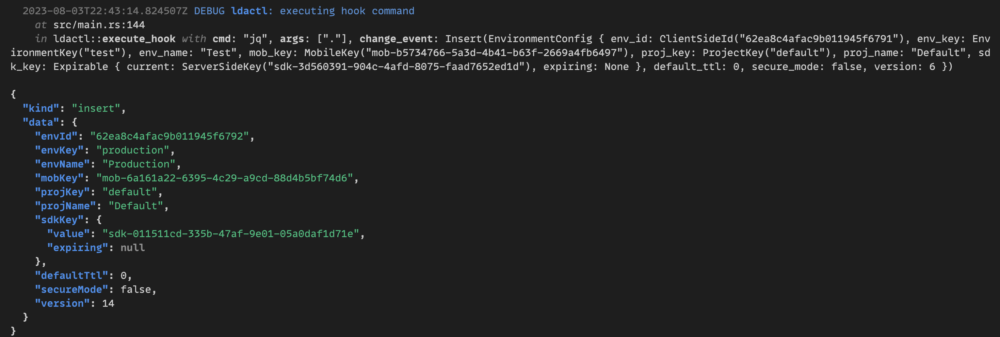
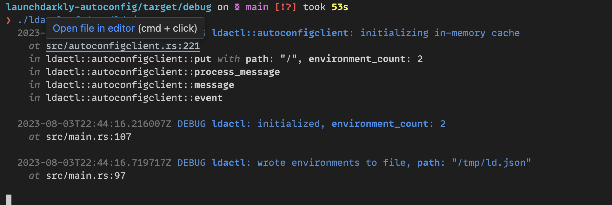

# ldactl

A simple utility for accessing LaunchDarkly Relay AutoConfig Streams (Enterprise only).

## Usage

```
Usage: ldactl [OPTIONS] --credential <CREDENTIAL> [-- <EXEC_ARGS>...]

Arguments:
  [EXEC_ARGS]...
          Arguments to pass to the exec command.

Options:
  -k, --credential <CREDENTIAL>
          The LaunchDarkly Relay AutoConfig key to use. See https://launchdarkly.com/docs/sdk/relay-proxy/automatic-configuration
          
          [env: LD_RELAY_AUTO_CONFIG_KEY=]

  -u, --stream-uri <URI>
          The URI of the LaunchDarkly Relay AutoConfig stream. For Federal: https://stream.launchdarkly.us/ For EU: https://stream.eu.launchdarkly.com
          
          [env: LD_STREAM_URI=]
          [default: https://stream.launchdarkly.com/]

  -o, --once
          Only run once and exit.

  -f, --output-file <OUT_FILE>
          Writes the JSON of all environments to a file. The file will be updated when changes are detected.
          
          [env: LDAC_OUTPUT_FILE=]

  -m, --exec-mode <EXEC_MODE>
          Mode for the exec command. When change-json, the change event will be written to STDIN. When env, the change event will only be available as environment variables.
          
          [env: LDAC_EXEC_MODE=]
          [default: env]
          [possible values: change-json, env]

  -e, --exec <EXEC>
          Execute a command with the change event. LDAC_* environment variables will be set with values from the change event.
          
          [env: LDAC_EXEC=]

  -h, --help
          Print help (see a summary with '-h')
```

## Key features

- Atomically write all environment configurations (SDK keys, mobile keys, etc) to a JSON file when updates are received
- Execute a hook command for every change event (insert, update, delete). Hooks will receive the payload environment variables or via JSON on STDIN
- Execute once with `--once` instead of subscribing for one-off updates

## Use cases

- Sync LaunchDarkly credentiuals to third-party services such as AWS secrets
- Render configuration files and restart services when SDK keys are rotated

### Examples

#### Executing `jq`



#### Writing to a file




## Integrating with Cloud Providers and Secrets Managers

Example scripts can be found in the `hooks/` directory.

### AWS SSM

```
ldactl --exec /hooks/write-aws-ssm.sh
```

#### Docker

```
docker build -t ldactl-aws-ssm -f Dockerfile.aws .
docker run -e LD_RELAY_AUTO_CONFIG_KEY=... ldactl-aws-ssm
```


